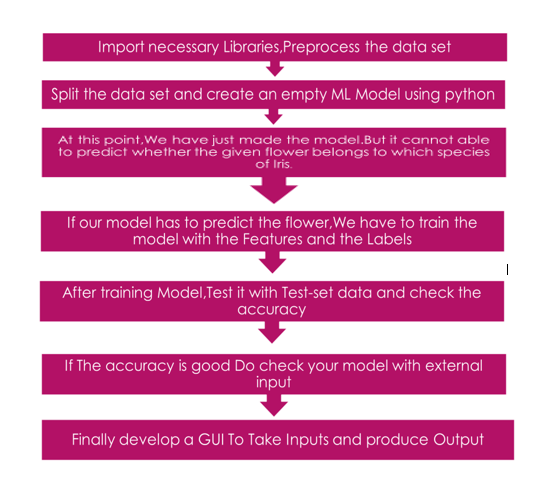
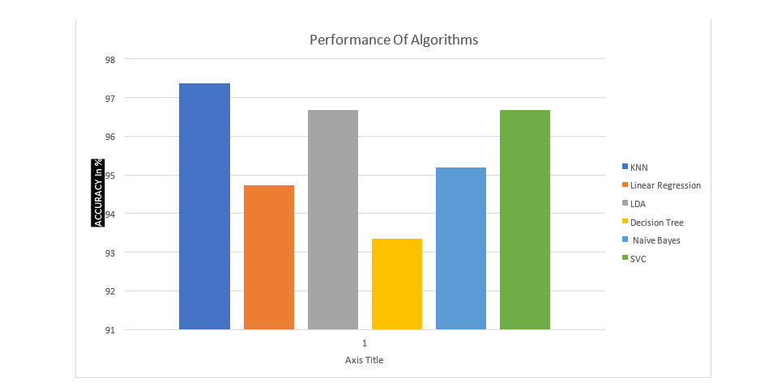
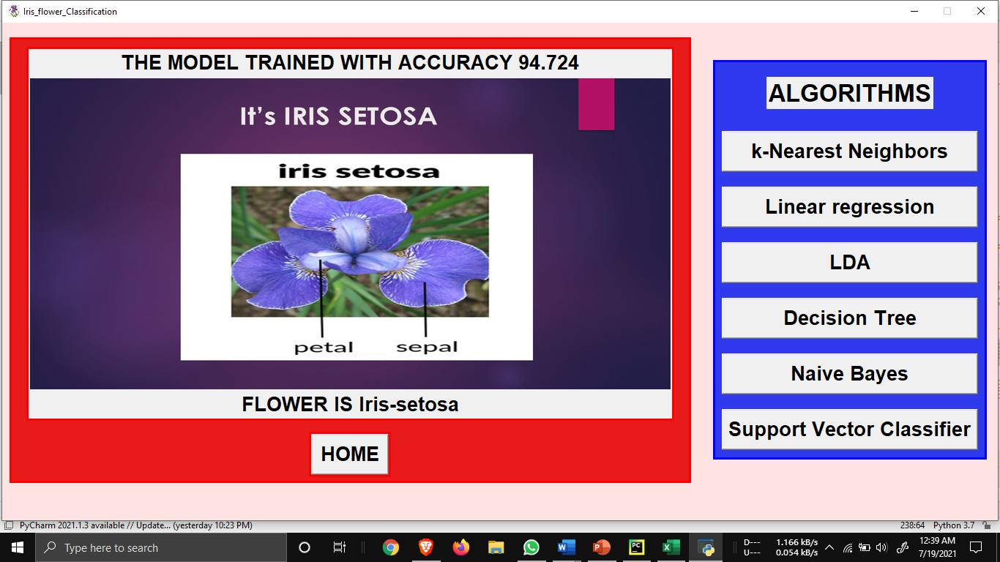
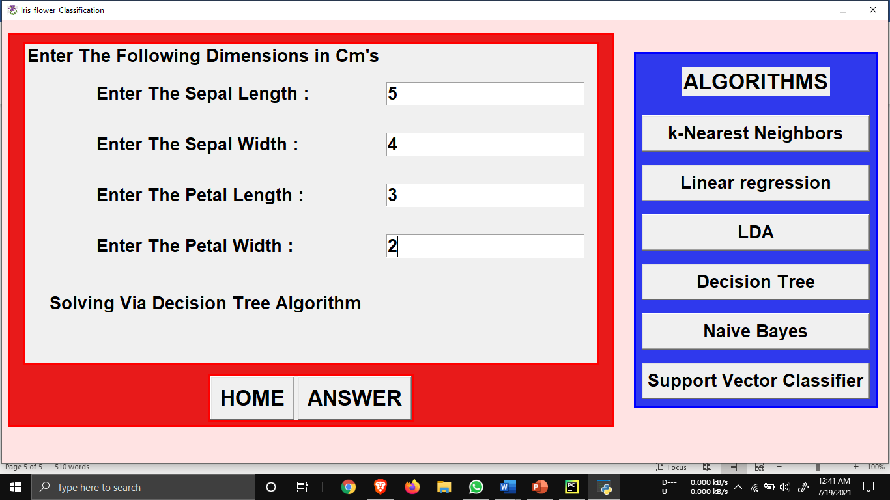
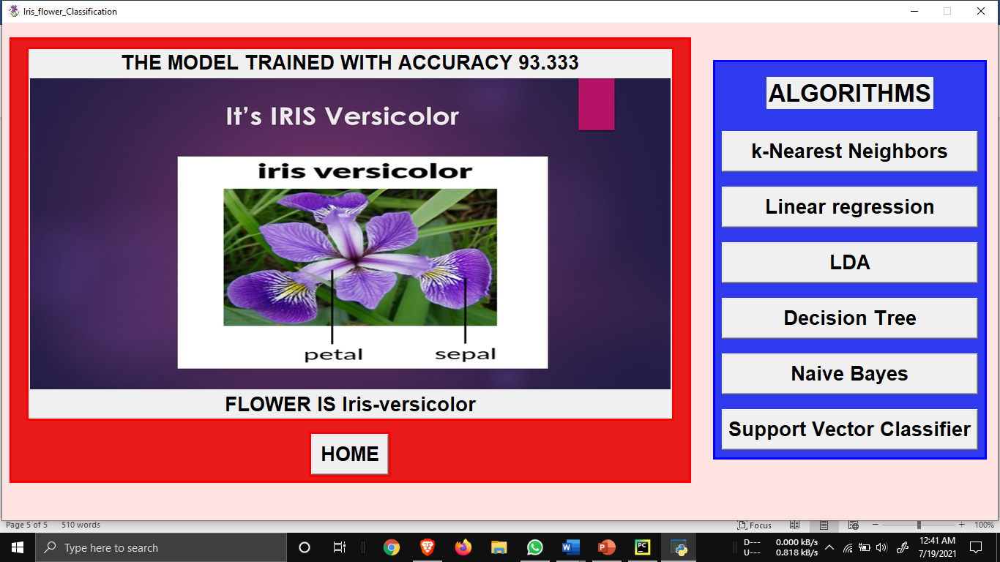
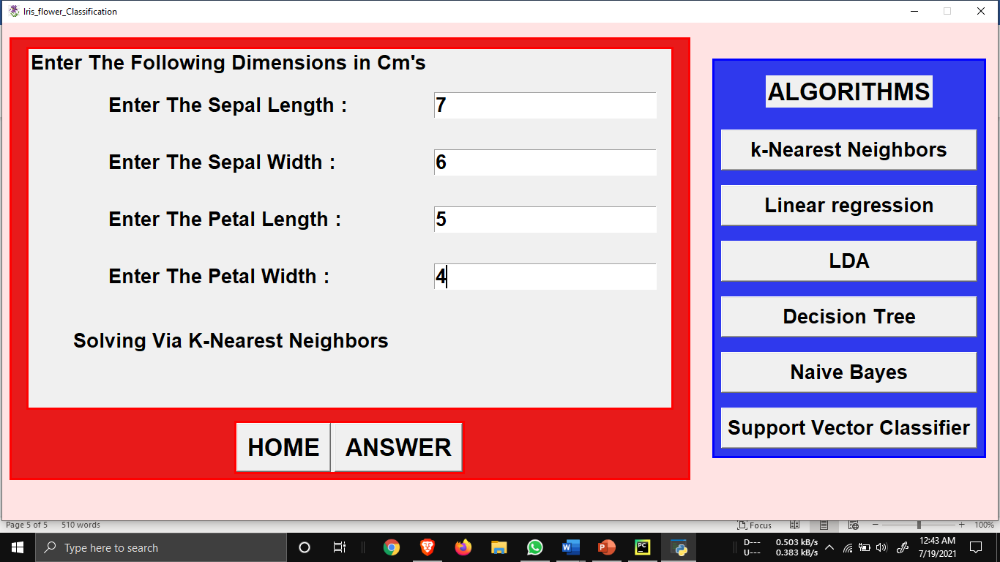
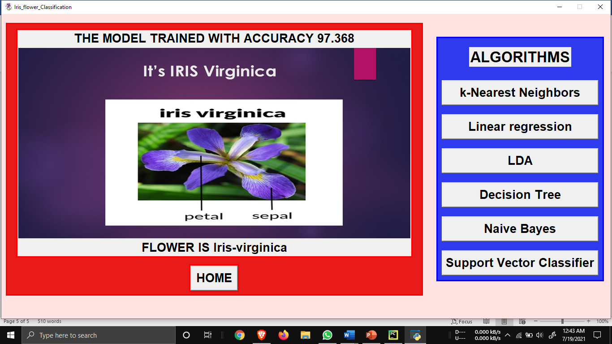

# Impacteers Project

# IRIS FLOWER CLASSIFICATION USING MACHINE LEARNING 
 
## ABSTRACT : 
IRIS flower classification is a basic Machine learning problem to be solved.This project helps new Machine Learning aspirants to give a grand entry to the field of ML.This problem can be solved via many traditional ML Algorithms with variying error rates.As this problem is easy and can be solved by many ML Algorithms,ML newbie can learn an algorithm and apply it on this problem,in the process he understands 
How ML works.Now coming to project,the aim is to classify iris flowers among three species (setosa, versicolor, , or virginica) from measurements of sepals and petals length and width.IRIS data set can be downloaded from https://archive.ics.uci.edu/ml/datasets/iris or any websites like kaggle.This data set relatively smaller one than others like MNIST and EMNIST etc.. The iris data set contains 3 classes of 50 instances each, where each class refers to a type of iris plant.Once we can develop a ML model to classify IRIS Species we can apply the same procedure to solve complex ML problems like hand written digit recognition.So we took up this process and applied 6 different ML Algorithms to classify IRIS species most of our implementation is from scratch. 
 
 
## PROBLEM STATEMENT: 
IRIS FLOWER CLASSIFICATION USING MACHINE LEARNING ALGORITHMS 
 
 
 
## METHODOLOGY: 
This project is developed using tkinter,numpy,pandas,sklearn libraries of  python programming language.tkinter is especially used to develop a graphical user interface for taking inputs(Length,width of petals and sepals) and to produce output i.e which class thus the flower with specified dimensions belong to.Numpy and Pandas are used to preprocess the dataset and also for the implementation of ML Algorithms from scratch.sklearn is used for importing some statistical methods to calculate accuracy,splitting data etc.. 
 
 
## ARCHITECTURE: 
This project is done by 5 members each one has to choose atleast one ML Algorithm and should develop a model to classify IRIS species. 
General architecture for this project is as follows every individual has to follow this: 
1.	Develop your own interpretation of the project brief 
2.	Research and understand your project’s site context 
3.	Figure out your constraints 
4.	Research precedents and case studies 
5.	Sketch, sketch and sketch! 
 
## SOFTWARE AND HARDWARE USED: 
 
## SOFTWARE:  
Programming language: python 
Machine Learning Packages: 
1.	tkinter 
2.	numpy 
3.	pandas 
4.	sklearn 
IDE: Pycharm 
 
## HARDWARE: 
Simulated on Laptop (i5 8th generation, 8gb RAM,dual core). 
 
## TECHNICAL DESCRIPTION: 
This project mainly consists of two phases: 
  In phase 1 we need to develop a machineLearning model that should be trained on training dataset and should perform well on the test dataset.Also we need to verify whether our model works better with external inputs as well. 
  In phase 2 we need to develop a GUI for taking inputs from the user and then producing outputs.Ensure that every frame and every button functions well in the GUI. 
 
 
## ML ALGORITHMS USED: 
 	1)Decision Tree Classifier 
 	2)Linear Regression 
 	3)K-nearst neighbours 
 	4)Naive Bayes 
 	5)Linear Discriminant Analysis 
 	6)Support Vector Classifier 
 	Why These? 
 These algorithms are fundamental ML Algorithms and can give high accuracy among them 3-4 algorithms can be implemented from scratch easily.  
 
 
## SOURCE CODE: 
https://github.com/KrishnaRohithVemulapalli/impacteers 
 
 
 
 
## PROJECT DIAGRAM: 
 
 
 
  
  
  
    
  
  
 
 
 
 
 
 
 
## PERFORMANCE OF ALGORITHMS: 
  

## RESULTS: 
 
## INPUT: 
  

  
 
 
 
## Output: 
   
 
 
 
## Input: 
  
  
 
## Output: 
 
   
 
 
 
## Input: 
  
  
 
## Output: 
  
  
 
 
 
            
 
 
 
 
